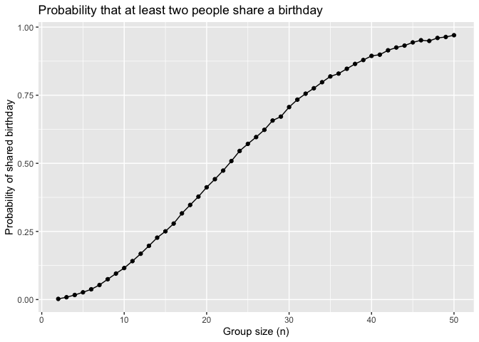

p8105_Hw5_jkh2157
================
2025-11-11

## Question 1

## Creating the birthday simulation function

``` r
bday_sim = function(n_room) {
  birthdays = sample(1:365, n_room, replace = TRUE)
  repeated_bday = length(unique(birthdays)) < n_room
  repeated_bday
}
bday_sim(20)
```

    ## [1] FALSE

## Running simulaton for room sizes 2-50

``` r
bday_sim_results = 
  expand_grid(
    bdays = 2:50,
    iter = 1:10000   
  ) %>% 
  mutate(
    results = map_lgl(bdays, bday_sim)
  ) %>% 
  group_by(bdays) %>% 
  summarize(
    prob_repeat = mean(results)
  )

#adding summary table 
bday_sim_results %>% 
  knitr::kable(
    digits = 3,
    caption = "Estimated probability that at least two people share a birthday"
  )
```

| bdays | prob_repeat |
|------:|------------:|
|     2 |       0.002 |
|     3 |       0.009 |
|     4 |       0.017 |
|     5 |       0.027 |
|     6 |       0.038 |
|     7 |       0.053 |
|     8 |       0.075 |
|     9 |       0.095 |
|    10 |       0.116 |
|    11 |       0.141 |
|    12 |       0.168 |
|    13 |       0.197 |
|    14 |       0.227 |
|    15 |       0.250 |
|    16 |       0.279 |
|    17 |       0.316 |
|    18 |       0.347 |
|    19 |       0.378 |
|    20 |       0.412 |
|    21 |       0.442 |
|    22 |       0.473 |
|    23 |       0.508 |
|    24 |       0.545 |
|    25 |       0.571 |
|    26 |       0.596 |
|    27 |       0.623 |
|    28 |       0.657 |
|    29 |       0.671 |
|    30 |       0.706 |
|    31 |       0.734 |
|    32 |       0.756 |
|    33 |       0.775 |
|    34 |       0.798 |
|    35 |       0.819 |
|    36 |       0.829 |
|    37 |       0.847 |
|    38 |       0.865 |
|    39 |       0.879 |
|    40 |       0.894 |
|    41 |       0.899 |
|    42 |       0.915 |
|    43 |       0.925 |
|    44 |       0.932 |
|    45 |       0.944 |
|    46 |       0.952 |
|    47 |       0.949 |
|    48 |       0.960 |
|    49 |       0.964 |
|    50 |       0.970 |

Estimated probability that at least two people share a birthday

As the group sizes increase, it becomes more likely that there will be
atleast 2 people who share the same birthday. \## Creating visualization

``` r
bday_sim_results %>% 
  ggplot(aes(x = bdays, y = prob_repeat)) +
  geom_point() +
  geom_line() +
  labs(
    title = "Probability that at least two people share a birthday",
    x = "Group size (n)",
    y = "Probability of shared birthday"
  )
```

<!-- -->
