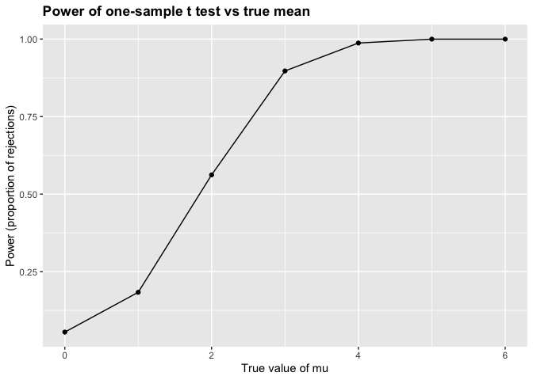
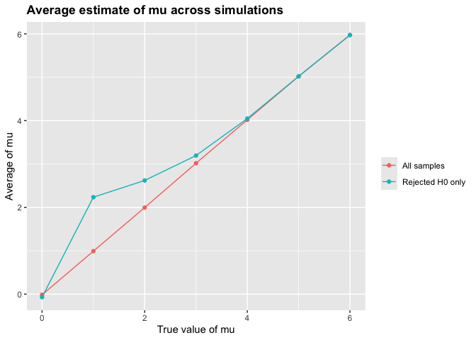
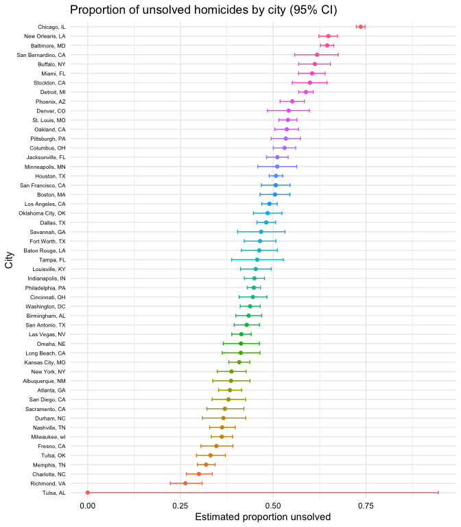

p8105_Hw5_jkh2157
================
2025-11-11

# Question 1

## Creating the birthday simulation function

``` r
bday_sim = function(n_room) {
  birthdays = sample(1:365, n_room, replace = TRUE)
  repeated_bday = length(unique(birthdays)) < n_room
  repeated_bday
}
bday_sim(20)
```

    ## [1] FALSE

## Running simulaton for room sizes 2-50

``` r
bday_sim_results = 
  expand_grid(
    bdays = 2:50,
    iter = 1:10000   
  ) %>% 
  mutate(
    results = map_lgl(bdays, bday_sim)
  ) %>% 
  group_by(bdays) %>% 
  summarize(
    prob_repeat = mean(results)
  )

#adding summary table 
bday_sim_results %>% 
  knitr::kable(
    digits = 3,
    caption = "Estimated probability that at least two people share a birthday"
  )
```

| bdays | prob_repeat |
|------:|------------:|
|     2 |       0.002 |
|     3 |       0.009 |
|     4 |       0.017 |
|     5 |       0.027 |
|     6 |       0.038 |
|     7 |       0.053 |
|     8 |       0.075 |
|     9 |       0.095 |
|    10 |       0.116 |
|    11 |       0.141 |
|    12 |       0.168 |
|    13 |       0.197 |
|    14 |       0.227 |
|    15 |       0.250 |
|    16 |       0.279 |
|    17 |       0.316 |
|    18 |       0.347 |
|    19 |       0.378 |
|    20 |       0.412 |
|    21 |       0.442 |
|    22 |       0.473 |
|    23 |       0.508 |
|    24 |       0.545 |
|    25 |       0.571 |
|    26 |       0.596 |
|    27 |       0.623 |
|    28 |       0.657 |
|    29 |       0.671 |
|    30 |       0.706 |
|    31 |       0.734 |
|    32 |       0.756 |
|    33 |       0.775 |
|    34 |       0.798 |
|    35 |       0.819 |
|    36 |       0.829 |
|    37 |       0.847 |
|    38 |       0.865 |
|    39 |       0.879 |
|    40 |       0.894 |
|    41 |       0.899 |
|    42 |       0.915 |
|    43 |       0.925 |
|    44 |       0.932 |
|    45 |       0.944 |
|    46 |       0.952 |
|    47 |       0.949 |
|    48 |       0.960 |
|    49 |       0.964 |
|    50 |       0.970 |

Estimated probability that at least two people share a birthday

As the group sizes increase, it becomes more likely that there will be
atleast 2 people who share the same birthday.

## Creating visualization

``` r
bday_sim_results %>% 
  ggplot(aes(x = bdays, y = prob_repeat)) +
  geom_point() +
  geom_line() +
  labs(
    title = "Probability that at least two people share a birthday",
    x = "Group size (n)",
    y = "Probability of shared birthday"
  )
```

<!-- -->

# Question 2

## Creating T-Test function

``` r
sim_ttest = function(mu, n = 30, sigma = 5) {
  
  x = rnorm(n, mean = mu, sd = sigma)
  
  t_out = t.test(x, mu = 0)
  
  broom::tidy(t_out) %>% 
    select(estimate, p.value) %>% 
    rename(
      mu_hat  = estimate,
      p_value = p.value
    )
}
```

## Running Simulation

``` r
sim_results = 
  expand_grid(
    true_mu = 0:6,
    iter    = 1:5000
  ) %>% 
  mutate(
    sim = map(true_mu, sim_ttest)
  ) %>% 
  unnest(sim) %>% 
  mutate(
    reject = p_value < 0.05
  )

sim_results %>% 
  filter(true_mu %in% 0:6) %>%       
  select(true_mu, iter, mu_hat, p_value, reject) %>% 
  group_by(true_mu) %>% 
  slice_head(n = 5) %>%              
  knitr::kable(
    digits = 3,
    caption = "**Example of raw simulation results for μ = 0–6 (first 5 per group)**"
  )
```

| true_mu | iter | mu_hat | p_value | reject |
|--------:|-----:|-------:|--------:|:-------|
|       0 |    1 | -0.341 |   0.698 | FALSE  |
|       0 |    2 |  0.013 |   0.990 | FALSE  |
|       0 |    3 |  0.785 |   0.373 | FALSE  |
|       0 |    4 | -0.435 |   0.690 | FALSE  |
|       0 |    5 | -1.712 |   0.072 | FALSE  |
|       1 |    1 |  0.530 |   0.569 | FALSE  |
|       1 |    2 |  1.743 |   0.065 | FALSE  |
|       1 |    3 |  0.656 |   0.441 | FALSE  |
|       1 |    4 |  2.866 |   0.003 | TRUE   |
|       1 |    5 |  0.789 |   0.304 | FALSE  |
|       2 |    1 |  2.507 |   0.001 | TRUE   |
|       2 |    2 |  2.833 |   0.001 | TRUE   |
|       2 |    3 |  1.742 |   0.104 | FALSE  |
|       2 |    4 |  2.421 |   0.027 | TRUE   |
|       2 |    5 |  1.508 |   0.075 | FALSE  |
|       3 |    1 |  3.122 |   0.002 | TRUE   |
|       3 |    2 |  4.322 |   0.000 | TRUE   |
|       3 |    3 |  2.895 |   0.011 | TRUE   |
|       3 |    4 |  1.514 |   0.180 | FALSE  |
|       3 |    5 |  3.833 |   0.000 | TRUE   |
|       4 |    1 |  4.742 |   0.000 | TRUE   |
|       4 |    2 |  3.537 |   0.000 | TRUE   |
|       4 |    3 |  2.866 |   0.003 | TRUE   |
|       4 |    4 |  3.389 |   0.001 | TRUE   |
|       4 |    5 |  4.098 |   0.000 | TRUE   |
|       5 |    1 |  5.604 |   0.000 | TRUE   |
|       5 |    2 |  5.000 |   0.000 | TRUE   |
|       5 |    3 |  6.185 |   0.000 | TRUE   |
|       5 |    4 |  4.930 |   0.000 | TRUE   |
|       5 |    5 |  5.846 |   0.000 | TRUE   |
|       6 |    1 |  4.375 |   0.000 | TRUE   |
|       6 |    2 |  6.110 |   0.000 | TRUE   |
|       6 |    3 |  5.756 |   0.000 | TRUE   |
|       6 |    4 |  4.648 |   0.000 | TRUE   |
|       6 |    5 |  5.269 |   0.000 | TRUE   |

**Example of raw simulation results for μ = 0–6 (first 5 per group)**

Table only shows a few values since it was iterated 5000 times for each
mu

## Summarizing power and then making a plot

``` r
power_results=
  sim_results %>% 
  group_by(true_mu) %>% 
  summarize(
    power=mean(reject)
  )

power_results %>% 
  ggplot(aes(x=true_mu,y=power))+
  geom_point()+
  geom_line()+
  labs(
    title="Power of one-sample t test vs true mean",
    x="True value of mu",
    y="Power (proportion of rejections)")+
  theme(
    plot.title=element_text(face="bold")
  )
```

<!-- -->

As shown by the graph, when there is a larger effect size, there is
higher power, and therefore more rejections.

## Average mu vs true

``` r
mean_results = 
  sim_results %>% 
  group_by(true_mu) %>% 
  summarize(
    mean_all    = mean(mu_hat),
    mean_reject = mean(mu_hat[reject==TRUE])
  )

mean_results %>% 
  ggplot(aes(x = true_mu)) +
  geom_point(aes(y = mean_all, color = "All samples")) +
  geom_line( aes(y = mean_all, color = "All samples")) +
  geom_point(aes(y = mean_reject, color = "Rejected H0 only")) +
  geom_line( aes(y = mean_reject, color = "Rejected H0 only")) +
  labs(
    title = "Average estimate of mu across simulations",
    x = "True value of mu",
    y = "Average of mu"
  ) +
  scale_color_discrete(name = "") +
  theme(
    plot.title = element_text(face = "bold")
  )
```

<!-- -->

As the graph shows, the average of mu across rejected tests is not equal
to the true mu. This is because its biased upwards (especially when the
true mu is smaller) since only the extreme (significant) samples are
included. This illustrates a case of selection bias.

# Question 3

## Import data set

``` r
homicide_df = read_csv("Data/homicide-data.csv")
```

    ## Rows: 52179 Columns: 12
    ## ── Column specification ────────────────────────────────────────────────────────
    ## Delimiter: ","
    ## chr (9): uid, victim_last, victim_first, victim_race, victim_age, victim_sex...
    ## dbl (3): reported_date, lat, lon
    ## 
    ## ℹ Use `spec()` to retrieve the full column specification for this data.
    ## ℹ Specify the column types or set `show_col_types = FALSE` to quiet this message.

``` r
homicide_df = homicide_df %>%
  mutate(city_state = str_c(city, ", ", state))
```

The data set contains information on appx 55,000 homicide cases reported
by 50 large US city police departments between 2007-2017. Each row
represents a single homicide case, and include information about the
victim, location, and case outcome.

- uid – a unique identifier for each homicide case.
- reported_date – date the homicide was reported.
- victim_first, victim_last, victim_age, victim_sex, victim_race –
  demographic information about the victim.
- city and state – where the homicide occurred.
- lat and lon – latitude and longitude coordinates for the homicide
  location.
- disposition – case status, which can take one of three values: Closed
  by arrest, Closed without arrest (exceptionally cleared), Open/No
  arrest.

## Summarizing total homicides and unsolved

``` r
homicide_summary=homicide_df %>% 
  group_by(city_state) %>% 
  summarize(
    total_homicides=n(),
    unsolved=sum(disposition %in% c("Closed without arrest", "Open/No arrest"))
  )

homicide_summary %>% 
  arrange(desc(total_homicides)) %>% 
  head(10) %>% 
  knitr::kable(
    digits = 0,
    caption = "**Top 10 cities by total homicides and number unsolved (2007–2017)**"
  )
```

| city_state       | total_homicides | unsolved |
|:-----------------|----------------:|---------:|
| Chicago, IL      |            5535 |     4073 |
| Philadelphia, PA |            3037 |     1360 |
| Houston, TX      |            2942 |     1493 |
| Baltimore, MD    |            2827 |     1825 |
| Detroit, MI      |            2519 |     1482 |
| Los Angeles, CA  |            2257 |     1106 |
| St. Louis, MO    |            1677 |      905 |
| Dallas, TX       |            1567 |      754 |
| Memphis, TN      |            1514 |      483 |
| New Orleans, LA  |            1434 |      930 |

**Top 10 cities by total homicides and number unsolved (2007–2017)**

## Running prop.test

``` r
baltimore = homicide_summary %>%
  filter(city_state == "Baltimore, MD")

baltimore_test = prop.test(
  x = baltimore$unsolved,
  n = baltimore$total_homicides
)

baltimore_tidy=
  baltimore_test %>% 
  broom::tidy()

baltimore_tidy %>% 
  mutate(
    p.value = formatC(p.value, format = "e", digits = 2)
  ) %>% 
  select(estimate, conf.low, conf.high, p.value) %>%
  knitr::kable(
    caption = "**Proportion of unsolved homicides in Baltimore, MD**",
    digits = 3
  )
```

| estimate | conf.low | conf.high | p.value  |
|---------:|---------:|----------:|:---------|
|    0.646 |    0.628 |     0.663 | 6.46e-54 |

**Proportion of unsolved homicides in Baltimore, MD**

``` r
city_results =
  homicide_summary |>
  mutate(
    prop_test = map2(unsolved, total_homicides,
                     ~prop.test(.x, .y)),
    prop_tidy = map(prop_test, broom::tidy)
  ) |>
  unnest(prop_tidy) |>
  select(city_state, total_homicides, unsolved, estimate, conf.low, conf.high
  )
```

    ## Warning: There was 1 warning in `mutate()`.
    ## ℹ In argument: `prop_test = map2(unsolved, total_homicides, ~prop.test(.x,
    ##   .y))`.
    ## Caused by warning in `prop.test()`:
    ## ! Chi-squared approximation may be incorrect

``` r
city_results |>
  arrange(desc(estimate)) |>
  knitr::kable(
    digits = 3,
    caption = "**Top 10 cities by proportion of unsolved homicides**"
  )
```

| city_state         | total_homicides | unsolved | estimate | conf.low | conf.high |
|:-------------------|----------------:|---------:|---------:|---------:|----------:|
| Chicago, IL        |            5535 |     4073 |    0.736 |    0.724 |     0.747 |
| New Orleans, LA    |            1434 |      930 |    0.649 |    0.623 |     0.673 |
| Baltimore, MD      |            2827 |     1825 |    0.646 |    0.628 |     0.663 |
| San Bernardino, CA |             275 |      170 |    0.618 |    0.558 |     0.675 |
| Buffalo, NY        |             521 |      319 |    0.612 |    0.569 |     0.654 |
| Miami, FL          |             744 |      450 |    0.605 |    0.569 |     0.640 |
| Stockton, CA       |             444 |      266 |    0.599 |    0.552 |     0.645 |
| Detroit, MI        |            2519 |     1482 |    0.588 |    0.569 |     0.608 |
| Phoenix, AZ        |             914 |      504 |    0.551 |    0.518 |     0.584 |
| Denver, CO         |             312 |      169 |    0.542 |    0.485 |     0.598 |
| St. Louis, MO      |            1677 |      905 |    0.540 |    0.515 |     0.564 |
| Oakland, CA        |             947 |      508 |    0.536 |    0.504 |     0.569 |
| Pittsburgh, PA     |             631 |      337 |    0.534 |    0.494 |     0.573 |
| Columbus, OH       |            1084 |      575 |    0.530 |    0.500 |     0.560 |
| Jacksonville, FL   |            1168 |      597 |    0.511 |    0.482 |     0.540 |
| Minneapolis, MN    |             366 |      187 |    0.511 |    0.459 |     0.563 |
| Houston, TX        |            2942 |     1493 |    0.507 |    0.489 |     0.526 |
| San Francisco, CA  |             663 |      336 |    0.507 |    0.468 |     0.545 |
| Boston, MA         |             614 |      310 |    0.505 |    0.465 |     0.545 |
| Los Angeles, CA    |            2257 |     1106 |    0.490 |    0.469 |     0.511 |
| Oklahoma City, OK  |             672 |      326 |    0.485 |    0.447 |     0.524 |
| Dallas, TX         |            1567 |      754 |    0.481 |    0.456 |     0.506 |
| Savannah, GA       |             246 |      115 |    0.467 |    0.404 |     0.532 |
| Fort Worth, TX     |             549 |      255 |    0.464 |    0.422 |     0.507 |
| Baton Rouge, LA    |             424 |      196 |    0.462 |    0.414 |     0.511 |
| Tampa, FL          |             208 |       95 |    0.457 |    0.388 |     0.527 |
| Louisville, KY     |             576 |      261 |    0.453 |    0.412 |     0.495 |
| Indianapolis, IN   |            1322 |      594 |    0.449 |    0.422 |     0.477 |
| Philadelphia, PA   |            3037 |     1360 |    0.448 |    0.430 |     0.466 |
| Cincinnati, OH     |             694 |      309 |    0.445 |    0.408 |     0.483 |
| Washington, DC     |            1345 |      589 |    0.438 |    0.411 |     0.465 |
| Birmingham, AL     |             800 |      347 |    0.434 |    0.399 |     0.469 |
| San Antonio, TX    |             833 |      357 |    0.429 |    0.395 |     0.463 |
| Las Vegas, NV      |            1381 |      572 |    0.414 |    0.388 |     0.441 |
| Omaha, NE          |             409 |      169 |    0.413 |    0.365 |     0.463 |
| Long Beach, CA     |             378 |      156 |    0.413 |    0.363 |     0.464 |
| Kansas City, MO    |            1190 |      486 |    0.408 |    0.380 |     0.437 |
| New York, NY       |             627 |      243 |    0.388 |    0.349 |     0.427 |
| Albuquerque, NM    |             378 |      146 |    0.386 |    0.337 |     0.438 |
| Atlanta, GA        |             973 |      373 |    0.383 |    0.353 |     0.415 |
| San Diego, CA      |             461 |      175 |    0.380 |    0.335 |     0.426 |
| Sacramento, CA     |             376 |      139 |    0.370 |    0.321 |     0.421 |
| Durham, NC         |             276 |      101 |    0.366 |    0.310 |     0.426 |
| Nashville, TN      |             767 |      278 |    0.362 |    0.329 |     0.398 |
| Milwaukee, wI      |            1115 |      403 |    0.361 |    0.333 |     0.391 |
| Fresno, CA         |             487 |      169 |    0.347 |    0.305 |     0.391 |
| Tulsa, OK          |             583 |      193 |    0.331 |    0.293 |     0.371 |
| Memphis, TN        |            1514 |      483 |    0.319 |    0.296 |     0.343 |
| Charlotte, NC      |             687 |      206 |    0.300 |    0.266 |     0.336 |
| Richmond, VA       |             429 |      113 |    0.263 |    0.223 |     0.308 |
| Tulsa, AL          |               1 |        0 |    0.000 |    0.000 |     0.945 |

**Top 10 cities by proportion of unsolved homicides**

## Creating plot

``` r
city_results |>
  mutate(
    city_state = fct_reorder(city_state, estimate)
  ) |>
  ggplot(aes(x = city_state, y = estimate, color=city_state)) +
  geom_point(show.legend=FALSE) +
  geom_errorbar(aes(ymin = conf.low, ymax = conf.high), width = 0.4,show.legend = FALSE) +
  coord_flip() +
  labs(
    title = "Proportion of unsolved homicides by city (95% CI)",
    x = "City",
    y = "Estimated proportion unsolved"
  ) +
  theme_minimal() +
  theme(
   axis.text.y = element_text(size = 6, color = "black"), 
  axis.text.x = element_text(color = "black") )            
```

<!-- -->

The figure shows the estimate proportion of unsolved homicides across
major US cities. Chicago, New Orleans, and Baltimore appear to have the
highest proportions. In contrast, Tulsa, AL appears at the bottom with
an unusally low unsolved proportion (based on the data set this is
indicative of either a small sample size or reporting anomaly)
